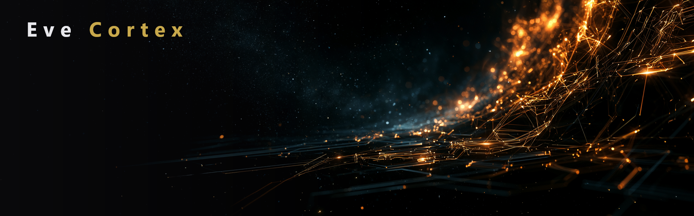

<p align="center">
  
</p>

<p align="center"><em>A local-first, free, open-source desktop companion for EVE Online.</em></p>

**Eve Cortex** is a desktop companion app for [EVE Online](https://www.eveonline.com/), running locally on the players system.  Ultimately I run many tools for my day to date activities in Eve (i.e., Ravworks, jEveAssets, Excel, etc.), and was looking for a single tool, where all of my data stayed local, and was completely free with source.  While the tool does not do everything today, it does the things I need it to do.  There is an AI agent integrated into the application, and it was added as I needed to play around with it to get some better familiarity in agent integration for my job, so we ended up with it in this tool.  It does have access to view all of the data in the tools DB, so possibly can answer questions that the UI is not setup to do.  Agent does come with optional TTS and voice input.  Included a number of both external paid options, as well as local alternatives to provide a variety of options, and also for me to get a little exposure with each.  That all being said, it will not be active unless you actually set it up, so you can ignore it if you choose.

I am currently developing and testing this on Windows, but the intent is to eventually provide builds for both Windows and Linux, which is why I ultimately went with Avalonia.  This will likely happen when I get to a point where I am okay with the functionality for the 1.0.0 release.

Keep in mind this application is still very green.  You are free to play around with it, but do expect issues during use.  Do not give up your old tools for this quite yet.  Needs a bit of a hardening period.

> **Status:** Beta (`0.9.x`). Actively developed — expect rough edges.

---

## Screenshots

<!--
  Add screenshots to docs/images/ and reference them here. Example:

  <p align="center">
    
  </p>
  <p align="center">
    
  </p>
-->

_Screenshots coming soon._

---

## Features

### Under the hood
- Background ESI pulls.  As long as application is running, data will refresh, and most UIs will automatically reflect those updates
- Definable market price definition, along with calculation and storage of price per item as market prices are refreshed.  This includes the ability to parse out lowball/highball prices, and base price calculations on % over build costs.  Useful for capitals and especially supers/titans.
- Ability to define detailed indy park, including different structures for different categories of items, as well as structure exceptions for specific items.  These are used for industry calculations.
- System calculates and stores the build cost for every craftable item in the game, and this updates as market prices are updated

### Industry / Trade
- Market Levels - Allows you to monitor a specific definable market for inventory of sell orders on a specific list of items
- Inventory Levels - Allow you to monitor your current inventory amounts (plus in build, buy, etc.) of a definable list of items (similar to jEveAssets stockpiles)
- Trade Opportunities - Compares markets for opportunities between them
- Net Worth - A Chart with lines to make you feel better/worse
- Production Calculator - Accurate calculation of production jobs for the player.  Includes build costs, materials needed, etc.

### Corporation
- Activity monitor to track income from ratting, industry, etc., as well as mining activity, kills, and corp project activity
- Corp Projects - View active and historical corp project details
- Standing projects - Allows you to define projects you want to always maintain (i.e., destroy NPC projects in any system in region X with ADM below 4.0)
- Top 10 Lists - Produces activity top 10 lists based on corp ESI data

### Other
- Character Viewer - Similar to the one in game in case you are abstaining from logging your character in for some reason
- Item Browser - Full items browser, and description/attributes/etc. of every item in the game.  Also includes current market orders and price history for defined markets.
- Asset Viewer - Search across all personal and corp assets
- Killmail viewer - Just corp and personal for the moment
- Alerts - On the overview of the main screen alerts will show for things the tool believes you should look at (definable)
- Eve Mail - Read and write eve mail... just because

### AI Agent ("Eden")
- Built-in conversational assistant with access to your character/corp data via tool calls
- Configurable to use external (Claude/OpenAI) or local (i.e., Ollama)
- Optional text-to-speech (Piper local TTS or ElevenLabs) and speech-to-text (local Whisper or OpenAI) for hands-free interaction
- Customizable name and voice

---

## Tech stack

- [Avalonia UI](https://avaloniaui.net/) 11 (cross-platform XAML UI framework) — currently built and tested on Windows (`net9.0-windows`)
- .NET 9, [ReactiveUI](https://www.reactiveui.net/) (MVVM)
- EF Core 9 with SQLite for local persistence
- [LiveChartsCore](https://livecharts.dev/) for charts
- CCP's [ESI API](https://esi.evetech.net/ui/) for all game data, with local caching of the Static Data Export (SDE)

---

## Getting started

### Requirements
- Windows 10/11
- [.NET 9 SDK](https://dotnet.microsoft.com/download/dotnet/9.0)

### Build & run

```powershell
git clone https://github.com/kernoeve/EveCortex.git
cd EveCortex
dotnet restore
dotnet run
```

On first launch, click **Log in with Eve** to authenticate a character via EVE's SSO. Your data is stored locally in SQLite at `%LOCALAPPDATA%\EveCortex\EveCortex.db`.

---

## Contributing

This project uses a `develop` → `main` branching model:

- `main` is the protected release branch — every merge into it triggers an automated build and gets tagged with an auto-incrementing patch version (`vMAJOR.MINOR.PATCH`).
- `develop` is the integration branch — branch your work off `develop` (`feature/your-thing`, `fix/your-thing`) and open a pull request back into it.
- Periodic `develop → main` PRs cut a new release.

---

## License

Eve Cortex is licensed under the [GNU General Public License v3.0](LICENSE).

---

*Eve Cortex is a third-party tool and is not affiliated with or endorsed by CCP Games. EVE Online and the EVE logo are trademarks of CCP hf.*
